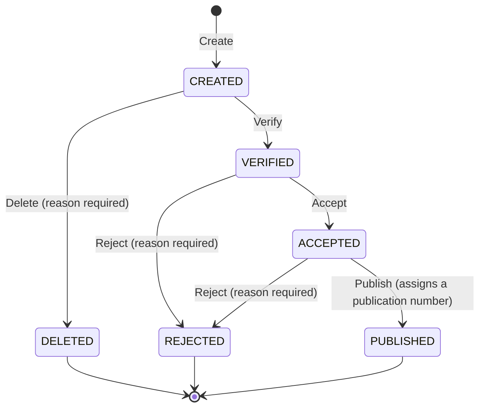

# Request Management Application

A backend service that manages the lifecycle of requests. Every request moves through a defined set
of states, and every transition is governed by the state diagram below — enforced in one place, by
the domain, and described as configuration rather than as code.

Built with Java 21, Spring Boot 3.5, Spring Data JPA, Flyway and Lombok. REST only, no GUI.

---

## The lifecycle



| Rule | Where it is enforced |
| --- | --- |
| A name and a body are mandatory at creation | `Request.create` |
| The body may only be changed in `CREATED` or `VERIFIED` | `Request.changeBody`, against the configured editable states |
| Deleting and rejecting require a reason | `Transition.reasonRequired`, checked in `Request.apply` |
| Publishing assigns a unique numeric identifier | `Transition.assignsPublicationNumber` + a database sequence |
| Every state change is recorded | `Request.apply` appends to the audit trail; entries are never rewritten |
| Requests are listable with pagination and filters | `RequestRepository.search` |

Deleting is a **state transition, not a row deletion**: a deleted request stays readable, together
with the reason it was deleted for, which is what makes the audit trail complete.

---

## Running it

The database is not part of the deliverable, so an in-memory H2 is configured by default and the
service is runnable as it is. A Maven wrapper is included (script only, no binaries committed).

```bash
./mvnw spring-boot:run
```

Then:

* API documentation — <http://localhost:8080/swagger-ui.html>
* OpenAPI document — <http://localhost:8080/v3/api-docs>
* Health — <http://localhost:8080/actuator/health>

To run against a real database, point the standard properties at it; the Flyway migration in
`src/main/resources/db/migration` is written in SQL that runs on both H2 and PostgreSQL:

```bash
DATABASE_URL=jdbc:postgresql://localhost:5432/requests \
DATABASE_USERNAME=requests \
DATABASE_PASSWORD=secret \
PUBLICATION_SEQUENCE_QUERY="SELECT nextval('publication_number_seq')" \
./mvnw spring-boot:run
```

### Building and testing

```bash
./mvnw verify
```

`verify` runs every test and then the coverage gate. The current build is **184 tests**, at
**99.6 % line** and **94.0 % branch** coverage. Lombok-generated members are excluded from the
figures, so the numbers describe hand-written code only.

---

## The API

Base path `/api/v1/requests`. All payloads are JSON; errors are
[RFC 7807](https://www.rfc-editor.org/rfc/rfc7807) problem documents.

| Method | Path | Purpose |
| --- | --- | --- |
| `POST` | `/api/v1/requests` | Create a request (`name` and `body` mandatory) |
| `GET` | `/api/v1/requests/{id}` | Read one request |
| `GET` | `/api/v1/requests` | Browse, paginated and filterable |
| `GET` | `/api/v1/requests/{id}/history` | Read the audit trail |
| `PUT` | `/api/v1/requests/{id}/body` | Replace the body |
| `POST` | `/api/v1/requests/{id}/verify` | `CREATED` → `VERIFIED` |
| `POST` | `/api/v1/requests/{id}/accept` | `VERIFIED` → `ACCEPTED` |
| `POST` | `/api/v1/requests/{id}/publish` | `ACCEPTED` → `PUBLISHED`, assigns the number |
| `POST` | `/api/v1/requests/{id}/reject` | → `REJECTED`, `reason` mandatory |
| `POST` | `/api/v1/requests/{id}/delete` | → `DELETED`, `reason` mandatory |

Browsing accepts `name` (case-insensitive fragment), `state`, `page` (default `0`) and `size`
(default `10`, capped at `100`), and returns the most recently created requests first.

### Status codes

| Situation | Status |
| --- | --- |
| Created | `201` with a `Location` header |
| Read, updated, transitioned | `200` |
| Missing or malformed input, missing reason | `400` |
| Unknown request | `404` |
| Transition not allowed, body not editable, concurrent modification | `409` |

A `409` for a refused transition tells the caller what *was* possible:

```json
{
  "type": "urn:request-management:problem:transition-not-allowed",
  "title": "Transition not allowed",
  "status": 409,
  "detail": "Action PUBLISH is not allowed while the request is CREATED; allowed actions: [VERIFY, DELETE]",
  "currentState": "CREATED",
  "attemptedAction": "PUBLISH",
  "allowedActions": ["DELETE", "VERIFY"]
}
```

Every representation of a request also carries `allowedActions` and `bodyEditable`, derived from the
configured workflow, so a client never has to hard-code the state diagram.

### A walk through the happy path

```bash
BASE=http://localhost:8080/api/v1/requests

ID=$(curl -s -X POST $BASE -H 'Content-Type: application/json' \
      -d '{"name":"Liquidity coverage ratio report","body":"First draft"}' | jq -r .id)

curl -s -X PUT  $BASE/$ID/body -H 'Content-Type: application/json' \
      -d '{"body":"Reviewed draft"}'
curl -s -X POST $BASE/$ID/verify
curl -s -X POST $BASE/$ID/accept
curl -s -X POST $BASE/$ID/publish     # -> "state":"PUBLISHED", "publicationNumber": 1

curl -s $BASE/$ID/history
curl -s "$BASE?name=liquidity&state=PUBLISHED&page=0&size=10"
```

Rejecting and deleting need a justification:

```bash
curl -s -X POST $BASE/$ID/reject -H 'Content-Type: application/json' \
      -d '{"reason":"Supporting evidence is missing"}'
```

---

## How the code is organised

Ports and adapters, three packages, dependencies pointing inwards only:

```
domain/           the business, in plain Java — no Spring, no JPA, no HTTP
  model/          Request (aggregate root), StateChange (audit entry), RequestId
  workflow/       RequestState, RequestAction, Transition, WorkflowDefinition, RequestWorkflow
  port/           RequestRepository, RequestIdGenerator, PublicationNumberGenerator
  query/          PageQuery, PageResult, RequestSearchCriteria
  exception/      the business rule violations

application/      the use cases: load the aggregate, let it decide, store the outcome
                  RequestManagement (inbound port) + RequestService, transaction boundaries

infrastructure/   everything replaceable
  config/         the workflow, page sizes and sequence statement, bound from configuration
  persistence/    JPA entities, mapper, specification factory and the repository adapter
  identity/       where request identifiers come from
  rest/           controller, DTOs and the RFC 7807 exception handler
```

Four decisions are worth calling out.

**The state diagram is data, not code.** `WorkflowDefinition` describes the lifecycle — initial
state, transitions, which transitions need a reason, which one hands out the publication number, and
in which states the body may be edited. It is bound from `application.yml`, so a change of lifecycle
is a change of configuration. `ConfigurableWorkflowIntegrationTest` proves it: the same binaries run
a shortened workflow where a request is published straight after verification.

**The domain does not know it is being persisted or exposed.** The aggregate receives the workflow,
the current time and — lazily — the publication number as parameters, so no rule depends on a
framework. Adapters read and write it through `RequestSnapshot` rather than through setters, and
`ArchitectureTest` fails the build if a Spring, JPA, Jackson or servlet type ever reaches the domain
package.

**Nothing reaches for a collaborator; every collaborator is handed over.** There is no `new`, no
static helper and no `UUID.randomUUID()` buried inside a class that has work to do. `RequestService`
receives the repository, the workflow, an id generator, a publication number generator and even the
clock, all as interfaces or immutable values. Inside the persistence adapter the mapper and the
specification factory are interfaces too, injected the same way. `ArchitectureTest` enforces the
style from the other side: no field may be annotated `@Autowired`, so dependencies stay visible in
the constructor, `final`, and as easy for a test to supply as for the container.

**Concurrency is handled where it happens.** Publication numbers come from a database sequence, so
they stay unique across instances, and requests carry an optimistic lock version, so two competing
transitions produce a `409` rather than a lost update.

### Boilerplate and formatting

Lombok generates what carries no meaning: constructors for injection (`@RequiredArgsConstructor`),
loggers (`@Slf4j`), and the accessors of the JPA entities (`@Getter`/`@Setter`, package private so
the mapping stays inside its own package). The domain aggregate uses `@Accessors(fluent = true)`, so
`request.name()` reads the same way a record does; the two accessors that do more than return a field
— `publicationNumber()`, which hands back an `Optional`, and `history()`, which hands back a copy —
are still written out by hand. `lombok.config` marks everything generated with `@lombok.Generated`,
which keeps it out of the coverage figures rather than inflating them.

The formatting rule, captured in `.editorconfig`: **a reader should never have to unpick a nested
call.** A chain that does more than one thing gets one call per line, arguments that do not fit get
one per line, and an intermediate result gets a name instead of being buried in an argument list.

```java
// not this
return new PageResult<>(found.getContent().stream().map(mapper::toDomain).toList(), page.page(), …);

// this
List<Request> content = found.getContent().stream()
        .map(mapper::toDomain)
        .toList();

return new PageResult<>(
        content,
        page.page(),
        page.size(),
        found.getTotalElements());
```

---

## Configuration

| Property | Default | Purpose |
| --- | --- | --- |
| `request-management.workflow.*` | the state diagram above | The lifecycle itself |
| `request-management.api.default-page-size` | `10` | Page size when the caller asks for none |
| `request-management.api.max-page-size` | `100` | Upper bound protecting the service |
| `request-management.publication.sequence-query` | `SELECT NEXT VALUE FOR publication_number_seq` | Vendor-specific statement drawing the next number |
| `DATABASE_URL` / `DATABASE_USERNAME` / `DATABASE_PASSWORD` | in-memory H2 | Where to store requests |

Removing the `request-management.workflow` block changes nothing: the service falls back to the same
lifecycle, defined once in `WorkflowDefinition.fromStateDiagram()`.

---

## Tests

| Level | What it covers |
| --- | --- |
| `RequestWorkflowTest` | Every state × action combination, checked against the diagram |
| `RequestTest` | The aggregate: invariants, audit trail, publication number |
| `RequestServiceTest` | The use cases, against a hand-written in-memory repository |
| `RequestControllerTest` | The web slice: status codes, payloads, problem documents |
| `JpaRequestRepositoryTest` | Mapping, appended history, filters, paging, the sequence |
| `RequestLifecycleIntegrationTest` | The whole stack, end to end |
| `ConfigurableWorkflowIntegrationTest` | The same stack running a different configured lifecycle |
| `ArchitectureTest` | The layering and constructor injection, enforced by ArchUnit |
| `request_lifecycle.feature` | The executable specification, in business language (Cucumber) |

The BDD scenarios are the ones to read first: they say what the service does without saying how.

---

## What is deliberately not here

Authentication, authorisation and multi-tenancy; they belong to the platform this service would be
deployed onto and none of them were part of the brief. `ASSUMPTIONS.md` lists every judgement call
made where the specification left room.
